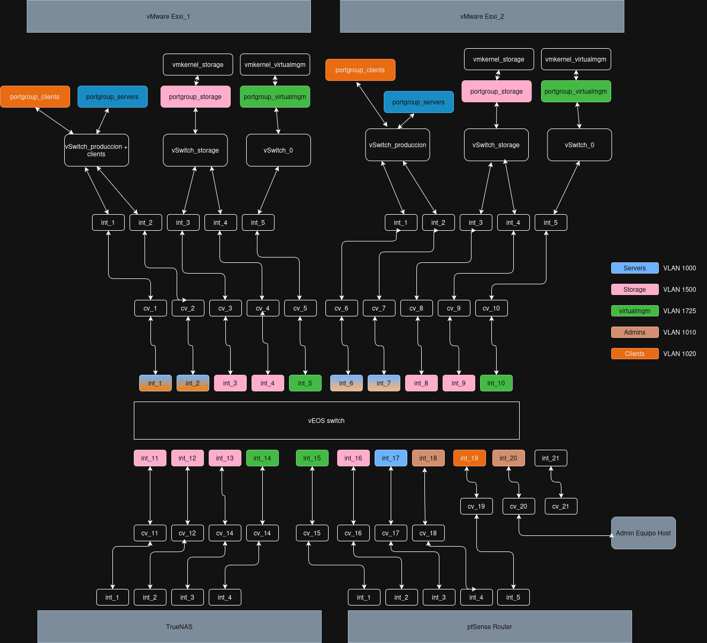

 ### Introducción

Este laboratorio está enfocado a practicar el despliegue de la infraestructura base que alojan los servicios. Se practicará lo siguiente:

* Configuración del laboratorio en HyperV como anfitrión de los hipervisores, almacenamiento y redes

	- Conf commutadores virtuales

	- Creacion y Conf vm's

	- Creacion HDD virtuales

* Configuración de switch (Arista vEOS)

	- Despliegue de un sw virtual

	- Conf basica del switch

	- Conf interfaces en acceso y troncal

	- Conf vlanes

* Configuración de router (Netgate pFsense)

	- Despliegue de firewall/router virtual

	- Conf basica del router

	- Conf interfaces

* Configuracion de hipervisores (vMware ESXi)

	- Despliegue de hipervisor ESXi

	- Conf basica hipervisor

	- Conf vswitches, portgroups, vmkernels

	- Conf almacenamiento en red

* Configuración NAS (TrueNAS)

	- Despliegue de TrueNAS

	- Asignación de discos

	- Creación RAID

	- Servir RAID a los hipervisores 

> *Laboratorio pendiente de realizar para confirmar si falta algo de información necesaria y relevante para llevarlo a cabo*

## 1- Preparacion de la Matriz Base (Hyper-V)

El objetivo de esta fase es dejar lista la infraestructura "fisica" que se va a virtualizar en el anfitrion para soportar toda la topologia.

#### Hitos a conseguir:

- Determinar y crear el tipo de conmutador virtual adecuado en Hyper-V para los 21 switches ( cv_1 a cv_21), garantizando el aislamiento del entorno de produccion.

## Modulo 2 - Despliegue de Electronica de Red (VEOS y pfSense)

En esta fase se debe levantar el nucleo de la red para garantizar que las diferentes capas de la infraestructura puedan comunicarse de forma segmentada.

#### Hitos a conseguir:

-  Desplegar la VM de VEOS y mapear correctamente sus 21 interfaces contra los conmutadores de Hyper-V segun el esquema de red.

> *(vEOS se obtiene en formato vmdk, qcow2, etc. es decir se descarga la imagen lista para crear una maquina virtual usando ese disco con el sistema operativo ya funcional). Se descarga desde la página de Arista y se necesita una cuenta*

-  Configurar la capa 2 en VEOS: creacién de VLANs (1000, 1010, 1020, 1500, 1725) y asignacion de puertos en modo acceso y troncal segun corresponda.

>*Ojo con las interfaces que salen hacia el ESXi cuando se le pone una VLAN se comporta de manera distinta*

-  Desplegar pfSense y mapear cada una de sus interfaces a su red correspondiente, actuando como Default Gateway para cada subred de forma independiente.

-  Configurar el direccionamiento en las interfaces de pfSense y establecer reglas de firewall permisivas (ICMP) para facilitar las pruebas de conectividad iniciales.

## Modulo 3 - Almacenamiento Centralizado (TrueNAS)

Despliegue y configuracion de la cabina de almacenamiento que proveera de Datastores a los hosts ESXi de forma concurrente.

#### Hitos a conseguir:

-  Desplegar la VM de TrueNAS mapeando sus interfaces a los conmutadores correspondientes segun el diagrama (Se instala mediante una ISO).

-  Aprovisionar desde Hyper-V 12 discos virtuales de 50GB en formato Thin Provisioning y adjuntarlos a la maquina de TrueNAS.

-  Configurar los pools en TrueNAS: creacion de dos vdevs en RAIDZ1, formados por 6 discos cada uno.

-  Levantar el servicio (iSCSI o NFS) y presentar el almacenamiento asegurando que solo sea accesible a través de la red dedicada (VLAN 1500).

## 4 - Hipervisores (ESXi)

Construccion del entorno de virtualizacion donde correran las cargas de trabajo, integrando las fases anteriores (redes y almacenamiento).

#### Hitos a conseguir:

- Desplegar ESXi_1y ESXi_2. Configurar la IP de gestion, asegurando el etiquetado correcto para la VLAN 1725.

- Replicar la arquitectura de red interna en ambos hosts: creacion de vSwitch_storage y vSwitch_produccion.

- Configurar los Portgroups (con su VLAN ID) y los adaptadores VMkernel 

> *La MTU se puede establecer para Storage en 9000 (es lo que se recomienda en producción), pero debe ser coherente en todos sus tramos para que no haya pérdida de paquetes*

- Conectar los ESXi al almacenamiento servido TrueNAS montar los Datastores compartidos.

## 5 - Validacion y Trazabilidad

Prueba de integracion total para confirmar que la configuración L2/L3, el almacenamiento y el cómputo operan en conjunto de forma correcta.

#### Hitos a conseguir:

- Desplegar una maquina virtual ligera (ej. Alpine Linux o Debian minimizado) en ESXi_1y asignarla al portgroup Servers .

- Desplegar una segunda maquina virtual ligera en ESXi_2 y asignarla al portgroup Clients .

- Desplegar una tercera maquina virtual conectada especificamente a la red de Storage . *Tambien se puede utilizar el equipo anfitrión y configurar una interfaz conectada a storage y asignarle un direccionamiento IP*

- Validar conectividad de almacenamiento: ejecutar ping desde la tercera VM (o desde el host, si le configuras una interfaz en storage) hacia la interfaz configurada para almacenamiento en el TrueNAS.

- Verificar la conectividad entre admins y clientes, admins y servidores, y verificar con un traceroute que efectivamente está el tráfico pasando por pfSense.

## Anexo: Propuesta direccionamiento
> No es necesario seguir esta tabla, es una simple propuesta para evitar que tengas que pensar en el direccionamiento y así ir a lo verdaderamente importante. (La tabla puede contener erratas, está pendiente de realizarse lab para confirmar)  

| Dispositivo / VM | Interfaz / Propósito | VLAN | Red (Subnet) | Dirección IP | Máscara | Puerta de Enlace (GW) |
| :--- | :--- | :--- | :--- | :--- | :--- | :--- |
| **pfSense (Router)** | int_1 (Gateway VirtualMgm) | 1725 | 10.0.17.0/24 | 10.0.17.1 | 255.255.255.0 | N/A |
| | int_2 (Gateway Storage) | 1500 | 10.0.15.0/24 | 10.0.15.1 | 255.255.255.0 | N/A |
| | int_3 (Gateway Servers) | 1000 | 10.0.10.0/24 | 10.0.10.1 | 255.255.255.0 | N/A |
| | int_4 (Gateway Admins) | 1010 | 10.0.11.0/24 | 10.0.11.1 | 255.255.255.0 | N/A |
| | int_5 (Gateway Clients) | 1020 | 10.0.12.0/24 | 10.0.12.1 | 255.255.255.0 | N/A |
| **vEOS (Switch Core)** | Interfaz de Gestión (VLAN 1725)| 1725 | 10.0.17.0/24 | 10.0.17.2 | 255.255.255.0 | 10.0.17.1 |
| **TrueNAS** | int_4 (Administración) | 1725 | 10.0.17.0/24 | 10.0.17.10 | 255.255.255.0 | 10.0.17.1 |
| | int_1 (Storage 1) | 1500 | 10.0.15.0/24 | 10.0.15.11 | 255.255.255.0 | 10.0.15.1 |
| | int_2 (Storage 2) | 1500 | 10.0.15.0/24 | 10.0.15.12 | 255.255.255.0 | 10.0.15.1 |
| | int_3 (Storage 3) | 1500 | 10.0.15.0/24 | 10.0.15.13 | 255.255.255.0 | 10.0.15.1 |
| **ESXi_1** | vmk_virtualmgm (Administración)| 1725 | 10.0.17.0/24 | 10.0.17.21 | 255.255.255.0 | 10.0.17.1 |
| | vmk_storage (Almacenamiento) | 1500 | 10.0.15.0/24 | 10.0.15.21 | 255.255.255.0 | 10.0.15.1 |
| **ESXi_2** | vmk_virtualmgm (Administración)| 1725 | 10.0.17.0/24 | 10.0.17.22 | 255.255.255.0 | 10.0.17.1 |
| | vmk_storage (Almacenamiento) | 1500 | 10.0.15.0/24 | 10.0.15.22 | 255.255.255.0 | 10.0.15.1 |
| **Admin Equipo Host** | Interfaz conectada a red Admins| 1010 | 10.0.11.0/24 | 10.0.11.10 | 255.255.255.0 | 10.0.11.1 |
| **VM Prueba (ESXi_1)**| Asignada a Portgroup Servers | 1000 | 10.0.10.0/24 | 10.0.10.10 | 255.255.255.0 | 10.0.10.1 |
| **VM Prueba (ESXi_2)**| Asignada a Portgroup Clients | 1020 | 10.0.12.0/24 | 10.0.12.10 | 255.255.255.0 | 10.0.12.1 |
| **VM Prueba (Storage)**| Asignada a Portgroup Storage | 1500 | 10.0.15.0/24 | 10.0.15.100 | 255.255.255.0 | 10.0.15.1 |
